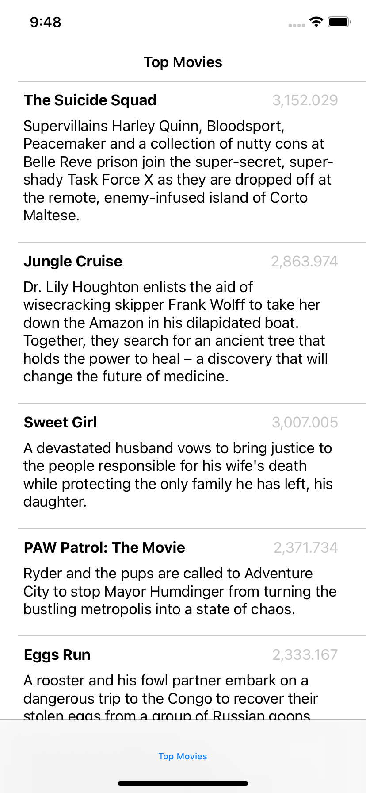

# 30 minute challenge: Movie Browser
I tried to challenge myself and build a themoviedb.org client in 30 minutes. It can fetch popular movies - and that's about it. :)

I have extended this a bit more outside of the 30 minute scope to play around with some other stuff (MVVM, coordinator, etc.)

## About
* Codable/URLSession
* UIKit/Storyboards
* Carve off DataSource à la Paul Hudson
* Coordinator for Navigation

## Screenshot

